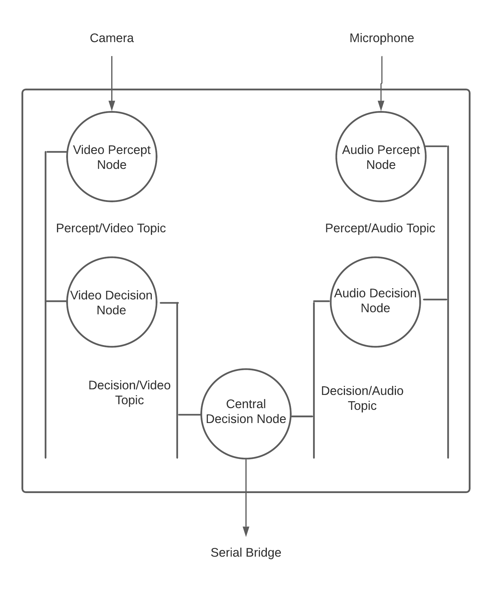

# Nemo: The Server Robot

## About

This repository contains the logical decision making component for Nemo, a server robot, designed to determine an appropriate time to interject in a conversation using audio / visual cues.

**NOTE**: This was presented as the final project for CS-131: Human-Robot Interaction, Fall 2021, at Tufts University. Partners for this project were
Matthew Toven, Soham Gaggenapally.

## Usage

OS: Ubuntu 20.04

To use, install and source [ros-2 foxy](https://docs.ros.org/en/foxy/Installation.html).

Compile instructions:

- Navigate to ./src directory.
- Install dependencies using rosdep: `rosdep install -i --from-path src --rosdistro foxy -y`
- Compile using: `colcon build --packages-select py_pubsub`
- Source using: `. install/setup.bash`
- Navigate to launch directory: `cd ./src/ldm_unit/launch`
- Run nodes using launch file: `ros2 launch ldm_unit`

Common issues:

- Ensure the correct ROS-2 version is installed and sourced.
- Ensure rosdep is installed.
- Ensure that an audio device and video camera is connected to the system.

## Background

Going out to restaurants and bars is a large and common part of many people’s lives. The process is fairly
simple - you go to a designated person, order your items, and then wait to receive said items. Sometimes,
especially at restaurants, there is a time that you have to wait between the time you place your order and get
your order. Most of these times people engage in conversation or some other social activity, veering their
attention away to some other task. Interruptions into these conversations are usually taken as intrusive or
disruptive, and with the advent of new robots that can physically bring food and drinks to people, finding the
right timing to interrupt people or their conversations becomes a key consideration in their design. In order to look at the question of when a robot should interrupt a conversation (with the purpose of serving food or drinks), we are looking at different social cues that can be incorporated into an algorithm to create a robot that can determine for itself whether the time is right to serve something, or in this case, a drink.

## Architecture

    

Figure 1 provides an overview of the architecture for Nemo's internal 'when to serve' decision making module. The module is a ROS-2 based implementation consisting of two percept nodes, two decision making nodes, and one central decision node. A major design choice for this module was to accommodate for sensory input streams in additional to the ones we currently use. For example, we might want to attach more than one camera or microphone or an entirely new sensory input form to Nemo. The percept nodes allow us to integrate data from multiple input streams and publish this data into percept topics. For example, in our current implementation, we the audio and video nodes publish data on the percept/audio and percept/video topics respectively. Next, each percept node has a corresponding decision node that subscribes to its data. The decision node is responsible for firing a Boolean trigger based on whether it is the appropriate time to serve specific to the type of sensory input. For example, the video decision node receives integrated video frames and maintains a frame analysis buffer. Frame analysis consists of detecting faces for a particular frame and, if a face is found, detecting the particular emotion based on image data. Similarly, the audio decision should node receive audio stream data and maintain a buffer to detect silence and potentially recognize voice commands. Note that we were unable to achieve full functionality on the audio percept node. Once a decision node determines a Boolean trigger, it publishes its decision on its respective decision topic (decision/video, decision/audio etc.). Finally, the central decision node subscribes to decision node for all types of sensory inputs and is responsible for generating a final decision based on weight-age assigned to each decision topic. It then uses serial communication with the Raspberry pi to forward the final decision and trigger the appropriate physical action. Note that the rate at which the central trigger fires is a hyper-parameter based on physical constrains (movement speed, serial speed etc.).
